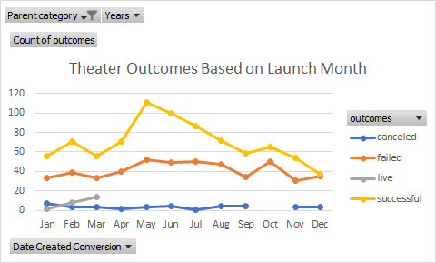

# Kickstarting with Excel

## Overview of Project

### Purpose
To visualize campaign outcomes based on their launch dates and their funding goals.
## Analysis and Challenges

### Analysis of Outcomes Based on Launch Date
The data set suggests that kickstarter projects launched in May and June are more likely to have a higher chance of success, as roughly 68% of campaigns launched in May were successful and 65% respectively in June.

### Analysis of Outcomes Based on Goals
The data shows that the most succesfull campaigns were launched with goals between $1000-$4999 with a success rate of roughly 66%. The success rate for projects with goals above $5000 is below %50. The date seems to suggest that kickstarter is a platform that works best for smaller less capital intensive projects. 
  
### Challenges and Difficulties Encountered

## Results

- What are two conclusions you can draw about the Outcomes based on Launch Date?

- What can you conclude about the Outcomes based on Goals?

- What are some limitations of this dataset?

- What are some other possible tables and/or graphs that we could create?
