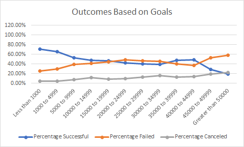

# Kickstarting with Excel

## Overview of Project

### Purpose
To visualize campaign outcomes based on their launch dates and their funding goals.
## Analysis and Challenges

### Analysis of Outcomes Based on Launch Date
The data set suggests that kickstarter projects launched in May and June are more likely to have a higher chance of success, as roughly 68% of campaigns launched in May were successful and 65% respectively in June.

### Analysis of Outcomes Based on Goals
The data shows that the most succesfull campaigns were launched with goals between $1000-$4999 with a success rate of roughly 66%. The success rate for projects with goals above $5000 is below %50. The date seems to suggest that kickstarter is a platform that works best for smaller less capital intensive projects. 
  

  
### Challenges and Difficulties Encountered
While creating the outcomes based on goals worksheet I learned that when pastinging forumulas cell locations are relative to the destination cell. This made my aproach to create a data table take a little bit longer.

## Results
- We can conclude based on the data that for the highest chance of success a campaign should consider launching between the months of May and June.

- Based on the data I would be hesitant to launch a campign in the fall or winter, campaigns launced in December have a near 50% failure rate.

- The insight gained on my analysis of the data suggests that Kickstarter is an ideal tool to secure small amounts of funding, while projects with bigger budgets are more than likely to be unsuccessful.

- It has to be stated that this data set ranges campaigns launced from the year 2009 and spanning through 2017. The data is dated at this point and new trends may have emerged within the 3 year timespan from now and 2017. 

- Out of my own personal curiosity I would like to create a graph of worldwide games campaigns and compare the US's performance

